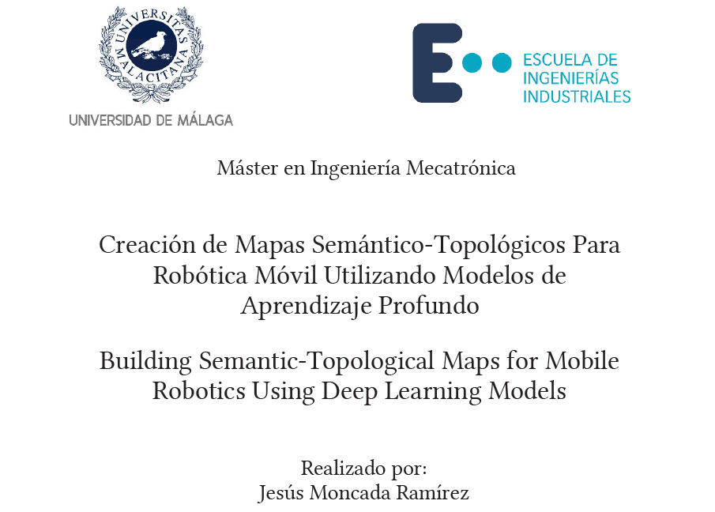
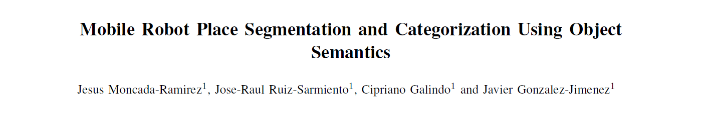

# Generative Topological Maps

Generative Topological Maps is a framework for *place segmentation and categorization*, and *semantic object relationships inference* within pre-built semantic maps containing information about objects.

This work was completed as the Master’s Thesis of Jesús Moncada Ramírez for the M.Sc. in Mechatronics Engineering at the University of Málaga.

- **[Full Thesis Report](doc/pdfs/tfm_report.pdf)**
- **[Presentation Slides](doc/pdfs/tfm_presentation.pdf)**



A core component of the place segmentation and categorization pipeline has been accepted and presented at the European Conference on Mobile Robotics (ECMR) 2025 in Padua, Italy.

- **[ECMR 2025 Conference Paper](doc/pdfs/ecmr_paper.pdf)**
- **[ECMR 2025 Presentation Slides](doc/pdfs/ecmr_slides.pdf)**
- **[ECMR 2025 Paper Poster](doc/pdfs/ecmr_poster.pdf)**



## Setup

In order to run the Python code in this repository you need to:

1. Create and activate a virtual environment
    ```bash
    python -m venv venv
    # On macOS/Linux
    source venv/bin/activate
    # On Windows (PowerShell)
    .\venv\Scripts\Activate.ps1
    ```
2. Install dependencies
    ```bash
    pip install --upgrade pip
    pip install -r requirements.txt
    ```

## Code Organization

### `data` folder

- **`data/semantic_maps/`**  
  Contains ten semantic maps sourced from **ScanNet** (`scannet_*.json`) and **SceneNN** (`scenenn_*.json`).  
  All the methods presented in the thesis and the ECMR 2025 paper were deployed and tested on these maps.  
  To experiment with your own semantic maps, place additional files in this folder using the same JSON schema.

- **`data/clusterings/`**  
  Stores the **ground-truth place segmentations** corresponding to each semantic map in `data/semantic_maps/`.  
  These ground truths are essential for evaluating the proposed methods, computing metrics, and performing ablation studies, as detailed in the thesis and conference paper.

### `doc` folder

- **`doc/pdfs/`**  
  Includes all related documents:
  - `tfm_report.pdf` – Complete Master’s Thesis report.  
  - `tfm_presentation.pdf` – Defense presentation slides.  
  - `ecmr_paper.pdf` – ECMR 2025 accepted paper.  
  - `ecmr_slides.pdf` – ECMR 2025 talk slides.  
  - `ecmr_poster.pdf` – ECMR 2025 poster.

- **`doc/images/`**  
  Contains figures and illustrations used in the thesis and README, such as cover pages (`tfm_title.png`, `ecmr_title.png`).

### Scripts

Three shell scripts are provided to run the main pipelines for **place segmentation & categorization** and **semantic-relationship inference**:

- **`tfm_places.sh`**  
  Runs all place-segmentation and categorization methods described in the Master’s Thesis.  
  ```bash
  ./tfm_places.sh
  ```  
  Results are written to `results/places_results/`.

- **`tfm_relationships.sh`**  
  Runs all semantic-relationship inference methods described in the Master’s Thesis.  
  ```bash
  ./tfm_relationships.sh
  ```  
  Results are written to `results/relationships_results/`.

- **`ecmr.sh`**  
  Reproduces the semantic place-segmentation and categorization experiments presented in the ECMR 2025 paper.  
  ```bash
  ./ecmr.sh
  ```  
  Results are also saved in `results/places_results/`.  
  ⚠️ **Important:** Save any outputs produced by `tfm_places.sh` elsewhere before running this script to avoid overwriting them.  
  **Note**: minor implementation tweaks may cause slight numerical differences from the published paper, but the model hierarchy remains the same.

### `src` folder

The `src` folder contains the project code, organized into modules and subpackages, each handling a specific part of the pipeline:

- **`ask_queries.py`**  
  Generates prompts for evaluating LLMs in response to user queries about semantic maps including information about places and relationships between objects.  
  Used for the qualitative evaluation of an LLM equipped with a semantic map in the Master’s thesis.

- **`check_places_ground_truth.py`**  
  Validates ground‑truth place‑segmentation annotations in `data/clusterings/` for consistency and completeness.  
  Run this script whenever a ground‑truth JSON file is modified to ensure no object is missing.

- **`constants.py`**  
  Centralizes global constants such as file paths, method names, default parameter values, and environment variable keys.

- **`evaluate_places.py`**  
  Computes clustering metrics to evaluate segmentations in `results/places_results/` against ground truths in `data/clusterings/`.  
  Outputs tables with metrics including Normalized Mutual Information (NMI), V‑Measure, and Adjusted Rand Index (ARI).

- **`inspect_clusters.py`**  
  Provides 2D/3D visualizations of the places generated by the segmentation and categorization methods.  
  Useful for qualitative evaluation and method development.

- **`inspect_semantics.py`**  
  Visualizes the distribution of semantic descriptors produced by different methods.  
  Enables comparisons, e.g., between BERT-based descriptors and those from the contextualized method implemented here.

- **`main_places.py`**  
  **Entry point for place segmentation and categorization.**  
  - `--stage` specifies `segmentation` or `categorization` (segmentation must be run first).  
  - `--method` selects which presented method to execute.  
  Results are saved to `results/places_results/`.

- **`main_relationships.py`**  
  **Entry point for semantic‑relationship inference.**  
  Runs the inference methods described in the thesis.  
  Results are saved to `results/relationships_results/`.

- **`embedding/`**
  Text‑embedding backends and base classes (`all_mpnet_base_v2_embedder.py`, `bert_embedder.py`, etc.).

- **`llm/`**
  LLM provider abstractions (`gemini_provider.py`, `huggingface_large_language_model.py`, `large_language_model.py`).

- **`prompt/`**
  Prompt templates and conversion history management (`place_segmenter_prompt.py`, `conversation_history.py`, etc.).

- **`semantic/`**
  Engines for descriptor computation, dimensionality reduction, and clustering (`semantic_descriptor_engine.py`, `clustering_engine.py`).

- **`show/`**  
  Visualization helpers for tables (`metrics_table.py`).

- **`utils/`**  
  General utilities for file I/O and data structures (`file_utils.py`, `dict_utils.py`).

- **`voxeland/`**  
  Domain classes for loading and handling semantic maps (`semantic_map.py`, `cluster.py`, etc.).

## Prompts

All prompts used in this project are implemented as Python classes inside [`src/generative_topological_maps/prompt/`](src/generative_topological_maps/prompt/):

- [`sentence_generator_prompt.py`](src/generative_topological_maps/prompt/sentence_generator_prompt.py)  
  Generates textual descriptions of object functionality within a scene.

- [`place_segmenter_prompt.py`](src/generative_topological_maps/prompt/place_segmenter_prompt.py)  
  Drives the place‑segmentation and categorization process performed entirely by an LLM.

- [`place_categorizer_prompt.py`](src/generative_topological_maps/prompt/place_categorizer_prompt.py)  
  Handles place categorization prompts used after segmentation.

- [`relationship_inferer_prompt.py`](src/generative_topological_maps/prompt/relationship_inferer_prompt.py)  
  Infers semantic relationships between objects using an LLM.

- [`relationship_inferer_with_image_prompt.py`](src/generative_topological_maps/prompt/relationship_inferer_with_image_prompt.py)  
  Infers semantic relationships using an LVLM with visual input.

- [`simple_scene_helper_prompt.py`](src/generative_topological_maps/prompt/simple_scene_helper_prompt.py) and [`complex_scene_helper_prompt.py`](src/generative_topological_maps/prompt/complex_scene_helper_prompt.py)  
  Evaluate LLM performance when answering user questions based on a semantic map:  
  - `simple_scene_helper_prompt.py` for maps containing only objects.  
  - `complex_scene_helper_prompt.py` for maps including objects, places, and relationships.

Support classes:  
- [`prompt.py`](src/generative_topological_maps/prompt/prompt.py) provides a common interface to manage all prompts.  
- [`conversation_history.py`](src/generative_topological_maps/prompt/conversation_history.py) manages LLM conversation histories.